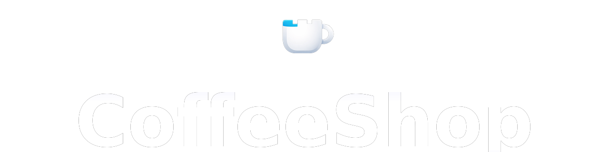
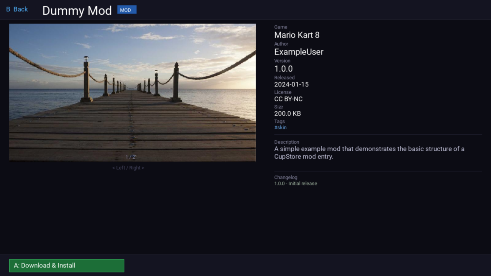
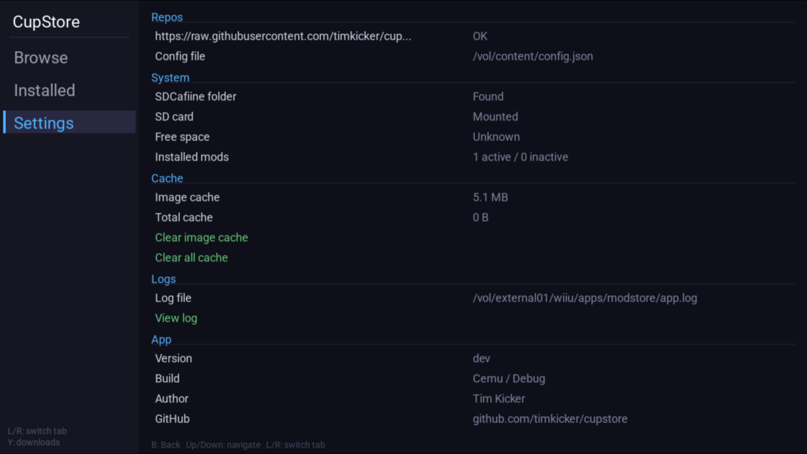
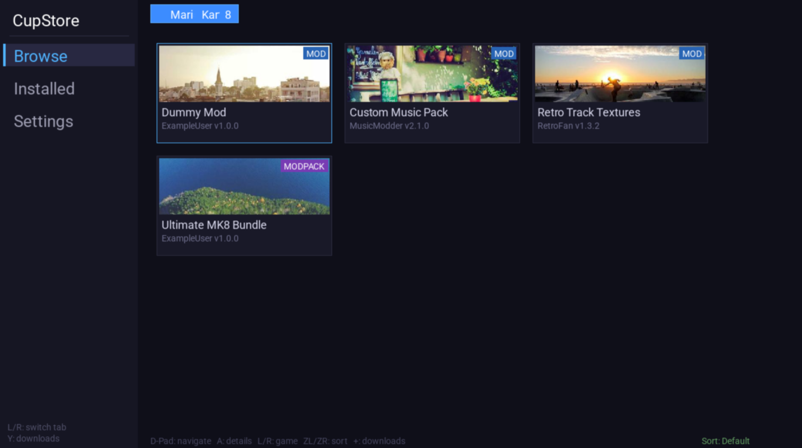

<p align="center">
  
</p>


<p align="center">
  <b>A mod manager for the Wii U. Browse, install and manage SDCafiine mods.</b>
</p>

<p align="center">
  <a href="https://github.com/timkicker/coffeeshop/actions">
    
  </a>
  <a href="https://github.com/timkicker/coffeeshop/releases/latest">
    
  </a>
  <a href="LICENSE">
    
  </a>
  
</p>


## Screenshots

<p align="center">
  
  
</p>
<p align="center">
  
</p>


## Features

- Browse and install mods from community-hosted repositories
- Per-game mod list with icons, tags, and metadata
- Download queue with progress and error recovery
- Activate / deactivate mods without uninstalling
- Conflict detection between active mods
- Update badges when newer versions are available
- Settings tab with repo management, cache control, and log viewer


## Installation

### Requirements
- Wii U with [Aroma](https://aroma.foryour.cafe/) installed
- SD card

### Steps

I've also created a [video tutorial on YouTube](https://youtu.be/FF4uRc8NvnI)

1. Download `wiiu_mod_store.wuhb` from the [latest release](https://github.com/timkicker/coffeeshop/releases/latest)
2. Copy it to `SD:/wiiu/apps/coffeeshop/wiiu_mod_store.wuhb`
3. Create `SD:/wiiu/apps/coffeeshop/config.json` with the [repos you want to use](#config.json-reference):
4. Launch CoffeeShop via the Homebrew Launcher

> **Note:** CoffeeShop does not come with a built-in mod repository. You need to provide your own repo URL. See [Hosting your own repo](#hosting-your-own-repo) below.

## Hosting your own repo

CoffeeShop loads mods from community-hosted repositories. To host your own:

1. Fork [coffeeshop-repo-template](https://github.com/timkicker/coffeeshop-repo-template)
2. Add your games and mods following the schema in the template README
3. Point your `config.json` at your fork's raw `repo.json` URL

The template includes a validation script and GitHub Action that checks your repo on every PR.


## config.json Reference

```json
{
  "repos": [
    "https://raw.githubusercontent.com/your-name/your-repo/main/repo.json",
    "https://raw.githubusercontent.com/someone-else/their-repo/main/repo.json"
  ]
}
```

Multiple repos are supported and merged at runtime.


## Contributing

PRs are welcome. Please read [CONTRIBUTING.md](CONTRIBUTING.md) first.

Branch strategy: `dev` is active development, `main` is stable/released. PRs go to `dev`.

Tests run without devkitPro:
```bash
cd tests && mkdir -p build && cd build
cmake .. && make && ./coffeeshop_tests
```


## License & Credits

Licensed under [GPLv3](LICENSE).

**Libraries**
- [devkitPro / WUT](https://devkitpro.org/): Wii U toolchain and runtime
- [SDL2](https://libsdl.org/): rendering, input
- [SDL2_ttf](https://github.com/libsdl-org/SDL_ttf): font rendering
- [SDL2_image](https://github.com/libsdl-org/SDL_image): image loading
- [libcurl](https://curl.se/libcurl/): HTTP downloads
- [nlohmann/json](https://github.com/nlohmann/json): JSON parsing
- [mbedTLS](https://github.com/Mbed-TLS/mbedtls): TLS for HTTPS
- [Catch2](https://github.com/catchorg/Catch2): unit testing
